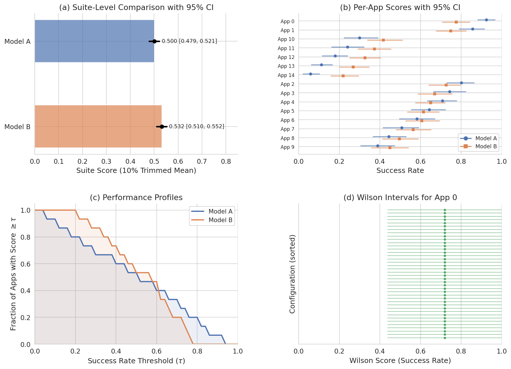
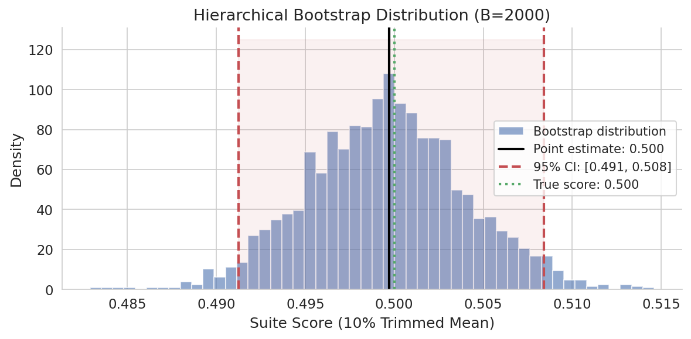
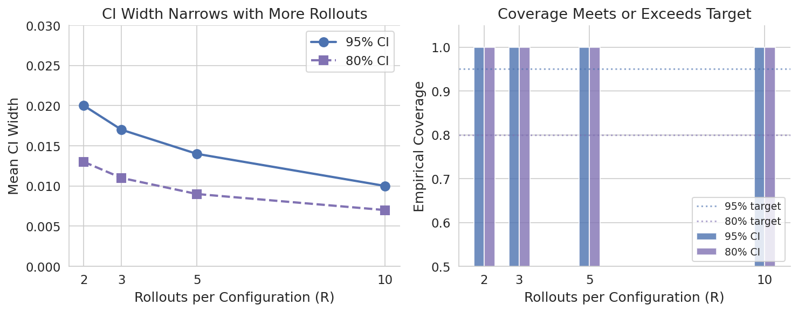
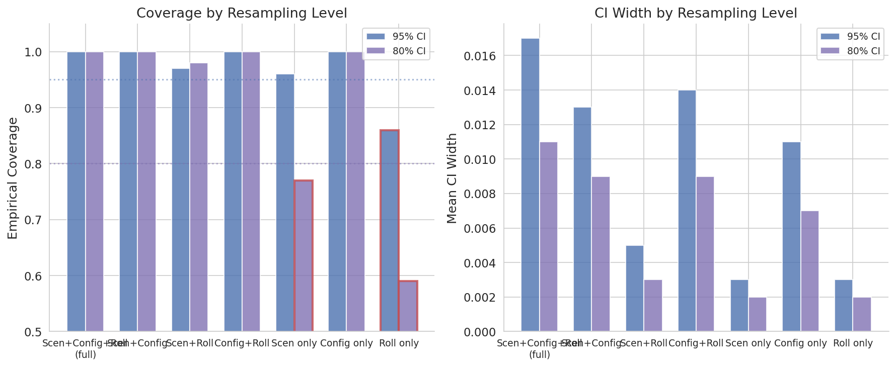
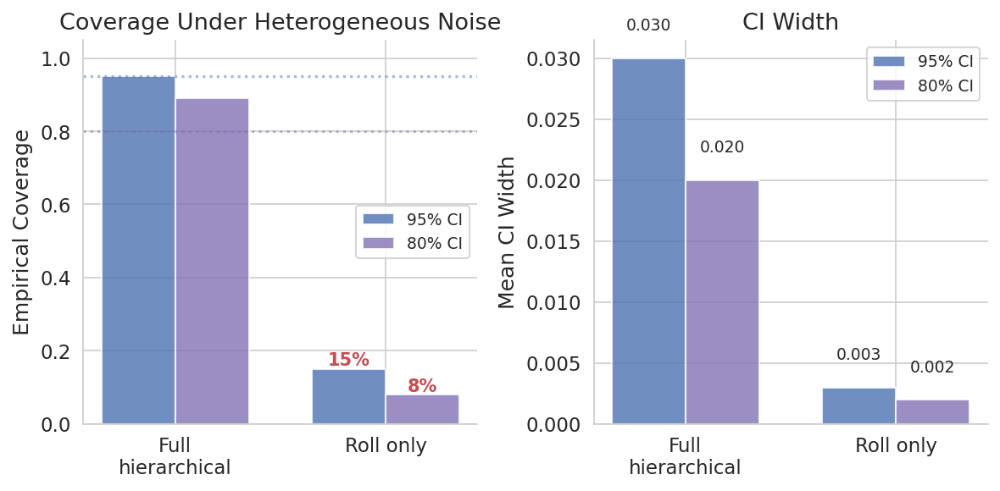
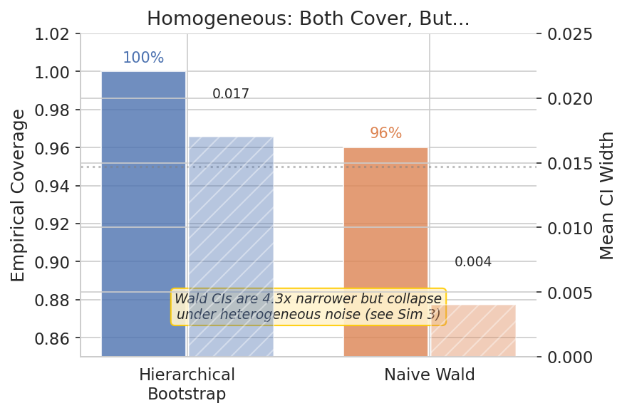
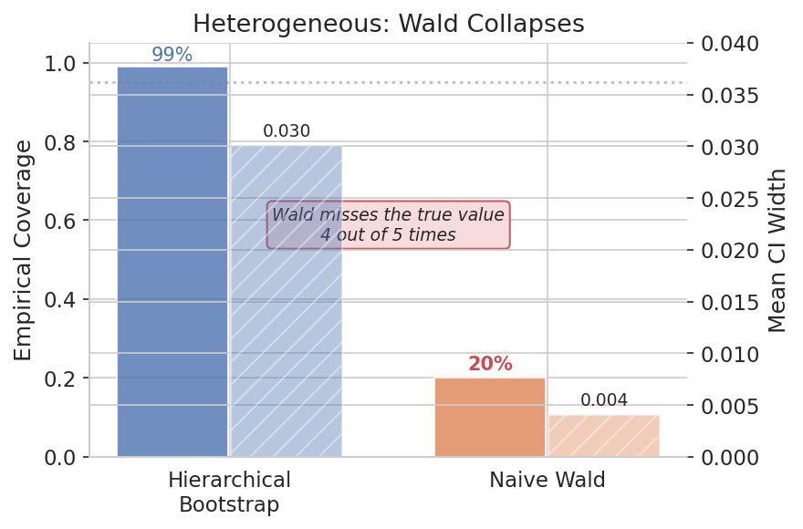

# reliable-cua

Statistical evaluation for PRISM-compliant Computer-Using Agent (CUA) benchmarks.

`reliable-cua` is a Python library for computing rigorous confidence intervals on CUA benchmark scores. It implements the hierarchical aggregation framework from *Computer Use at the Edge of the Statistical Precipice*, replacing the flat `(runs × tasks)` paradigm of [rliable](https://github.com/google-research/rliable) with a tree-structured approach that correctly handles the nested hierarchy of interactive benchmarks: **apps → scenarios → configurations → rollouts**.

<div align="center">
  
  <p><em>Suite-level comparison, per-app scores, performance profiles, and Wilson intervals — all generated from synthetic data using <code>reliable-cua</code>.</em></p>
</div>

## Key Features

- **Wilson score intervals** for per-configuration success rates with small sample sizes
- **Fixed-app hierarchical bootstrap** that resamples scenarios, configurations (instance, profile, theme, UI state), and rollouts while treating apps as a fixed population
- **Automatic configuration** that adapts resampling to whichever variability axes are active
- **Variability decomposition** (MAD, ATE, P(degradation)) to isolate the effect of each environmental axis
- **Performance profiles** with bootstrap CIs
- **Robust to missing data** — works with whatever subset of the combinatorial space was evaluated
- **Fast** — vectorized bootstrap using batch numpy indexing (~5s for 315K rollouts with B=1000)

## Installation

```bash
pip install -e .
```

Dependencies: `numpy`, `scipy`, `matplotlib`, `seaborn`.

## Quick Start

```python
import reliable_cua as rcua

# Simplest case: load results from amaia-collab JSONL
suite = rcua.load_jsonl("all_metrics.jsonl")

# Compute suite score with bootstrap CI
result = rcua.bootstrap_suite_score(suite)
print(f"Score: {result.point_estimate:.3f} "
      f"[{result.ci.lower:.3f}, {result.ci.upper:.3f}]")

# Per-app breakdown
app_results = rcua.bootstrap_per_app(suite)
for app_name, br in app_results.items():
    print(f"  {app_name}: {br.point_estimate:.3f} "
          f"[{br.ci.lower:.3f}, {br.ci.upper:.3f}]")
```

## Data Hierarchy

```
EvalSuite
├── App "banking"                           (FIXED — never resampled)
│   ├── Scenario "transfer"                 (resampled)
│   │   ├── Config (send_50, default, dark, home)   → rollouts: [✓, ✗, ✓]
│   │   ├── Config (send_50, default, light, home)  → rollouts: [✓, ✓, ✗]
│   │   ├── Config (send_200, default, dark, home)  → rollouts: [✗, ✓, ✓]
│   │   └── ...
│   └── Scenario "check_balance"
│       └── ...
├── App "email"
│   └── ...
└── ...
```

Each configuration is a tuple of four environmental axes: **(instance, profile, theme, ui_state)**. All four are treated uniformly — independently resampled in the bootstrap and independently decomposable via matched-pair analysis. When axes are disabled, the hierarchy collapses. In the simplest case (all axes off), it reduces to `Apps → Scenarios → Rollouts` — analogous to `rliable`'s `(games × seeds)` structure.

## Core Concepts

### Wilson Score Intervals

For binary outcomes (pass/fail) with small rollout counts (R=3–5), the standard Wald confidence interval has poor coverage. The Wilson score interval provides near-nominal coverage even at extreme success rates:

```python
from reliable_cua import wilson_score_interval

# 2 successes out of 3 rollouts
ci = wilson_score_interval(2, 3)
# point=0.585, lower=0.192, upper=0.895 (95% CI)
```

### Hierarchical Bootstrap

The fixed-app hierarchical bootstrap correctly propagates uncertainty from all active levels while treating the app population as fixed:

```python
from reliable_cua import bootstrap_suite_score, BootstrapConfig

result = bootstrap_suite_score(
    suite,
    trim_proportion=0.1,  # 10% trimmed mean
    config=BootstrapConfig(
        n_replicates=1000,
        confidence_level=0.95,
        seed=42,
    ),
)
```

The bootstrap automatically configures which levels to resample based on `suite.active_axes`. You can also manually control each level:

```python
config = BootstrapConfig(
    resample_scenarios=True,     # Always recommended
    resample_instances=True,     # Resample instance axis
    resample_profiles=True,      # Resample profile axis
    resample_themes=True,        # Resample theme axis
    resample_ui_states=True,     # Resample UI state axis
    resample_rollouts=True,      # Always recommended
)
```

### Variability Decomposition

Isolate the effect of each environmental axis using matched-pair analysis:

```python
from reliable_cua import decompose_all_axes

decomps = decompose_all_axes(suite, threshold=0.10)
for axis, d in decomps.items():
    print(f"{axis}: MAD={d.mad:.3f}, ATE={d.ate:.3f}, "
          f"P(deg)={d.p_degradation:.3f}")
```

## Loading Data

### From amaia-collab JSONL

```python
suite = rcua.load_jsonl("all_metrics.jsonl")
```

### From nested dict

```python
data = {
    "banking": {
        "transfer": {
            "send_50|default|dark|home": [True, True, False],
            "send_50|default|light|home": [True, False, False],
            "send_200|default|dark|home": [True, True, True],
        }
    }
}
suite = rcua.from_dict(data, active_axes=frozenset({"instance", "profile", "theme", "ui_state"}))
```

### From arrays (simplest case)

```python
import numpy as np

suite = rcua.from_arrays(
    app_names=["banking", "email"],
    scenario_names_per_app={
        "banking": ["transfer", "balance"],
        "email": ["send", "search"],
    },
    outcomes_per_app={
        "banking": np.array([[True, False, True], [True, True, False]]),
        "email": np.array([[False, True, True], [True, True, True]]),
    },
)
```

## Simulation Results

We validate the hierarchical bootstrap through Monte Carlo simulations with known ground truth. All simulations use 100 independent experiments, B=300 bootstrap replicates, 15 apps (fixed), 10 scenarios/app, and true app success probabilities spanning [0.05, 0.95] with 10% trimmed mean aggregation.

### What is coverage?

**Coverage** is the fraction of experiments where the confidence interval (CI) contains the true value. We generate synthetic benchmark data with a *known* ground-truth suite score, compute the bootstrap CI, and check whether the true score falls inside. A well-calibrated X% CI should achieve ≥X% coverage:
- A **95% CI** with 100% empirical coverage is *conservative* (slightly wider than necessary, but safe)
- A **95% CI** with 86% coverage is *anti-conservative* (too narrow — 14% of the time you'd report a CI that doesn't contain the truth)

<div align="center">
  
  <p><em>One bootstrap replicate: the distribution of resampled suite scores, with the 95% CI (red dashed) containing the true score (green dotted).</em></p>
</div>

### Simulation 1: Coverage vs. Number of Rollouts

The full hierarchical bootstrap achieves 100% coverage at both 95% and 80% confidence levels, with CI widths narrowing as R increases.

<div align="center">
  
</div>

| R | 95% Coverage | 95% Width | 80% Coverage | 80% Width | Bias |
|---|---|---|---|---|---|
| 2 | 1.000 | 0.020 | 1.000 | 0.013 | -0.0002 |
| 3 | 1.000 | 0.017 | 1.000 | 0.011 | +0.0000 |
| 5 | 1.000 | 0.014 | 1.000 | 0.009 | +0.0000 |
| 10 | 1.000 | 0.010 | 1.000 | 0.007 | +0.0001 |

### Simulation 2: Level Ablation — Which Resampling Levels Matter?

Not all resampling levels are optional. Omitting scenario resampling causes under-coverage, and the effect is worse at 80% than at 95%.

<div align="center">
  
</div>

| Resampling Levels | 95% Coverage | 95% Width | 80% Coverage | 80% Width |
|---|---|---|---|---|
| Scen + Config + Roll (full) | **1.000** | 0.017 | **1.000** | 0.011 |
| Scen + Config | 1.000 | 0.013 | 1.000 | 0.009 |
| Scen + Roll | 0.970 | 0.005 | 0.980 | 0.003 |
| Config + Roll | 1.000 | 0.014 | 1.000 | 0.009 |
| Scen only | 0.960 | 0.003 | 0.770 | 0.002 |
| Config only | 1.000 | 0.011 | 1.000 | 0.007 |
| **Roll only** | **0.860** | **0.003** | **0.590** | **0.002** |

Roll-only resampling produces CIs that are ~6x too narrow. At 80% confidence, it covers only 59% of the time — meaning over 2 in 5 CIs misses the true value.

### Simulation 3: Heterogeneous Within-App Noise

With realistic within-app heterogeneity (scenario noise σ=0.08, config noise σ=0.03), the difference between full and roll-only bootstrap is dramatic.

<div align="center">
  
</div>

| Method | 95% Coverage | 95% Width | 80% Coverage | 80% Width |
|---|---|---|---|---|
| Full hierarchical | **0.950** | 0.030 | **0.890** | 0.020 |
| Roll only | **0.150** | 0.003 | **0.080** | 0.002 |

Roll-only coverage collapses to 15% (95% CI) and 8% (80% CI). The CIs are 10× too narrow because they attribute all variability to agent stochasticity, ignoring the substantial scenario-level and config-level noise.

### Simulation 4: Deterministic Benchmark (No Config Axes)

With all environmental axes disabled (20 scenarios/app, rollouts only), the bootstrap correctly reduces to scenario + rollout resampling:

| CI Level | Coverage | Width |
|---|---|---|
| 95% | 0.990 | 0.090 |
| 80% | 0.970 | 0.058 |

### Simulation 5: Hierarchical Bootstrap vs. Naive Wald CI — Homogeneous

| Method | Coverage | CI Width |
|---|---|---|
| Hierarchical bootstrap | **1.000** | 0.017 |
| Naive Wald | 0.960 | 0.004 |

On homogeneous data the Wald CI achieves 96% coverage, but its CIs are 4.3× narrower than the hierarchical bootstrap.

<div align="center">
  
</div>

### Simulation 6: Hierarchical Bootstrap vs. Naive Wald CI — Heterogeneous

| Method | Coverage | CI Width |
|---|---|---|
| Hierarchical bootstrap | **0.990** | 0.030 |
| Naive Wald | **0.200** | 0.004 |

Under heterogeneous within-app noise (scenario σ=0.08, config σ=0.03), the Wald CI collapses to 20% coverage — missing the true value 4 out of 5 times — while the hierarchical bootstrap maintains 99% coverage. The Wald CI width stays at 0.004 regardless of the noise structure, because it ignores the hierarchical data structure entirely.

<div align="center">
  
</div>

### Reproducing

```bash
python -m reliable_cua.simulation   # ~5 minutes
python generate_figures.py          # generates images/
```

## Differences from rliable

| Aspect | rliable | reliable-cua |
|--------|---------|-------------|
| Data structure | Flat `(runs × tasks)` matrix | Hierarchical tree (apps→scenarios→configurations→rollouts) |
| Outcomes | Continuous scores | Binary (pass/fail) |
| Bootstrap | Stratified (resample runs per task) | Hierarchical (resample scenarios, configs, rollouts within fixed apps) |
| Base-level CI | None | Wilson score interval |
| Aggregation | IQM (25% trimmed mean) | 10% trimmed mean (configurable) |
| App/game treatment | Optional resampling | Always fixed |
| Variability analysis | Not supported | MAD, ATE, P(degradation) by axis |
| Dependencies | `arch`, `absl-py`, `pandas` | `numpy`, `scipy`, `matplotlib` only |
| Performance | ~50K bootstrap reps for 285-entry matrix | Vectorized 6D batch indexing; 315K rollouts × B=1000 in ~5s |

## Citation

```bibtex
@article{digiworld2026,
  title={Computer Use at the Edge of the Statistical Precipice},
  author={Anonymous},
  journal={NeurIPS},
  year={2026}
}
```

This library builds on ideas from:

```bibtex
@article{agarwal2021deep,
  title={Deep Reinforcement Learning at the Edge of the Statistical Precipice},
  author={Agarwal, Rishabh and Schwarzer, Max and Castro, Pablo Samuel
          and Courville, Aaron and Bellemare, Marc G},
  journal={Advances in Neural Information Processing Systems},
  year={2021}
}
```

## License

Apache 2.0
